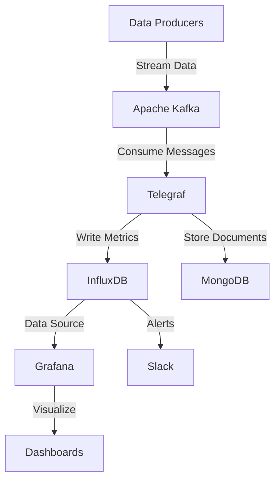

# Kafka to Grafana Data Pipeline

This project demonstrates how to connect Apache Kafka with Telegraf to stream data into InfluxDB, and then visualize it using Grafana dashboards. It includes MongoDB for persistent data storage and Slack integration for real-time notifications. It's a complete real-time data pipeline that shows the integration between streaming data (Kafka), data collection (Telegraf), time-series storage (InfluxDB), document storage (MongoDB), visualization (Grafana), and alerting (Slack).

## 🏗️ Architecture



## 🚀 Quick Start

### Prerequisites
- Docker
- Docker Compose

### Setup
1. **Clone the repository**
   ```bash
   git clone <your-repo-url>
   cd kafka_to_grafana_pipeline
   ```

2. **Configure environment variables**
   ```bash
   cp conf/variables.env.example conf/variables.env
   # Edit conf/variables.env with your settings
   ```

3. **Start the pipeline**
   ```bash
   docker-compose up -d
   ```

4. **Access the services**
   - **Grafana**: http://localhost:3000
   - **Kafdrop**: http://localhost:9000
   - **InfluxDB**: http://localhost:8086
   - **MongoDB**: localhost:27017

## 📁 Project Structure

```
kafka_to_grafana_pipeline/
├── docker-compose.yml          # Main orchestration file
├── conf/
│   ├── variables.env           # Environment variables
│   └── telegraf/              # Telegraf configuration
├── data/                      # Persistent data volumes
│   ├── grafana/               # Grafana data
│   ├── influxdb/              # InfluxDB data
│   └── mongodb/               # MongoDB data
├── DataSender/                # Data producer scripts
├── README.md                  # This file
└── .gitignore                 # Git ignore rules
```

## 🛠️ Technology Stack

- **Apache Kafka** (3.3.1) - Distributed streaming platform
- **Apache ZooKeeper** - Distributed coordination service
- **InfluxDB** - Time-series database
- **Telegraf** - Metrics collection agent
- **Grafana** - Data visualization and monitoring
- **MongoDB** - Document database
- **Kafdrop** - Kafka web UI
- **Slack** - Notifications and alerts

## ⚙️ Configuration

### Environment Variables
Key configuration is managed through `conf/variables.env`:

```env
## InfluxDB Configuration
DOCKER_INFLUXDB_INIT_MODE=setup
DOCKER_INFLUXDB_INIT_USERNAME=username
DOCKER_INFLUXDB_INIT_PASSWORD=password
DOCKER_INFLUXDB_INIT_ORG=Organization
DOCKER_INFLUXDB_INIT_BUCKET=system_state
DOCKER_INFLUXDB_INIT_ADMIN_TOKEN=influxdb_token

## Grafana Configuration
GRAFANA_ADMIN_USERNAME=admin
GRAFANA_ADMIN_PASSWORD=1234
```

### Default Credentials
- **Grafana**: admin/1234
- **InfluxDB**: username/password
- **Organization**: Organization
- **Bucket**: system_state

## 📊 Data Flow

1. **Data Production**: Applications send data to Kafka topics
2. **Stream Processing**: Telegraf consumes from Kafka and processes data
3. **Storage**: 
   - Time-series data → InfluxDB
   - Document data → MongoDB
4. **Visualization**: Grafana queries InfluxDB and displays dashboards
5. **Monitoring**: Kafdrop provides Kafka cluster monitoring
6. **Alerts**: InfluxDB sends notifications to Slack

## 🔧 Usage

### Starting the Pipeline
```bash
# Start all services
docker-compose up -d

# View logs
docker-compose logs -f

# Stop all services
docker-compose down
```

### Adding Data Sources in Grafana
1. Go to http://localhost:3000
2. Login with admin/1234
3. Add InfluxDB as a data source:
   - URL: http://influxdb:8086
   - Token: `influxdb_token`
   - Organization: `Organization`
   - Default Bucket: `system_state`

### Creating Dashboards
1. In Grafana, go to Dashboards → New Dashboard
2. Add panels and configure queries against InfluxDB

### Setting Up Alerts
1. Configure InfluxDB alerts to monitor your data
2. Set up Slack webhook integration for notifications
3. Define alert conditions and thresholds in InfluxDB

## 🐛 Troubleshooting

### Common Issues

**Grafana Login Issues**
- Default credentials: admin/1234
- If you can't login, reset the admin password:
  ```bash
  docker exec -it grafana grafana-cli admin reset-admin-password <newpassword>
  ```

**Services Not Starting**
- Check if ports are already in use:
  ```bash
  docker-compose ps
  docker-compose logs <service-name>
  ```

**Data Not Appearing**
- Verify Telegraf configuration in `conf/telegraf/telegraf.conf`
- Check Kafka topics in Kafdrop (http://localhost:9000)
- Verify InfluxDB connection in Grafana

### Useful Commands
```bash
# Check service status
docker-compose ps

# View specific service logs
docker-compose logs -f grafana
docker-compose logs -f telegraf

# Access container shell
docker exec -it grafana /bin/bash
docker exec -it influxdb /bin/bash

# Restart specific service
docker-compose restart telegraf
```

## 🔒 Security Notes

- Change default passwords in production
- Use environment variables for sensitive data
- Consider using Docker secrets for production deployments
- Network isolation is configured between services

## 📈 Monitoring

- **Kafdrop**: Monitor Kafka topics and messages
- **Grafana**: Create dashboards
- **InfluxDB**: Query time-series data and set up alerts
- **MongoDB**: Store and query document data
- **Slack**: Get alerts notifications

## 🤝 Contributing

1. Fork the repository
2. Create a feature branch
3. Make your changes
4. Test with `docker-compose up -d`
5. Submit a pull request

## 📝 License

MIT